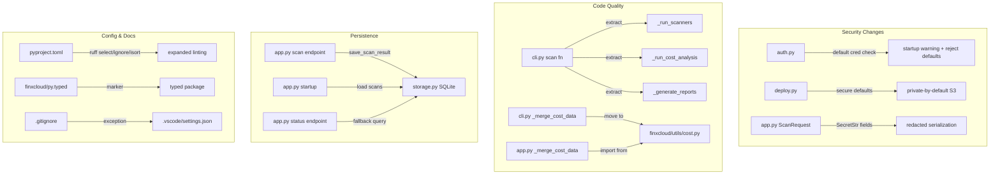

# Design Document: FinXCloud Improvements

## Overview

This design addresses 16 requirements spanning security hardening, code quality, testing infrastructure, configuration, and documentation for the FinXCloud multi-cloud cost optimization tool. The changes touch the FastAPI web dashboard, Click CLI, SQLite storage layer, S3 deployment module, and project configuration.

The design is organized into four workstreams:
1. **Security** (Req 1, 2, 4, 10): Default credential enforcement, secure S3 defaults, credential redaction, guarded imports
2. **Code Quality** (Req 5, 6, 7, 8): Import cleanup, CLI refactoring, shared merge utility, `__all__` exports
3. **Persistence & Testing** (Req 9, 11): Scan result persistence, test infrastructure
4. **Configuration & Docs** (Req 3, 12, 13, 14, 15, 16): Storage docs, py.typed, ruff config, VS Code settings, LICENSE, CONTRIBUTING

## Architecture



## Components and Interfaces

### 1. Auth Module Changes (`finxcloud/web/auth.py`)

**New function: `is_using_default_credentials() -> bool`**
Returns `True` when both `ADMIN_USERNAME` and `ADMIN_PASSWORD` are `"admin"`.

**New function: `check_default_credentials_startup() -> None`**
Called at module load time. Logs a `WARNING` via the module logger when defaults are detected.

**Modified function: `authenticate(username, password) -> str | None`**
Before issuing a token, checks `is_using_default_credentials()`. If `True`, returns `None` and the caller receives a specific error message instructing the operator to set `FINXCLOUD_ADMIN_USER` and `FINXCLOUD_ADMIN_PASS` environment variables.

**New `__all__`**: `["authenticate", "require_auth", "create_token", "decode_token", "verify_password", "hash_password_for_static", "is_using_default_credentials"]`

**Guarded import**: Wrap `import jwt` in try/except to raise a clear `ImportError` directing users to install `pip install finxcloud[web]`.

### 2. Deploy Module Changes (`finxcloud/web/deploy.py`)

**Modified function: `deploy_to_s3(..., public: bool = False) -> str`**
- New `public` parameter (default `False`)
- When `public=False` (default): skip `put_public_access_block` disable, skip public bucket policy, return S3 console URL (`https://s3.console.aws.amazon.com/s3/buckets/{bucket}`)
- When `public=True`: current behavior (disable public access blocks, set public policy, return website URL), plus log a warning

### 3. ScanRequest Model Changes (`finxcloud/web/app.py`)

**Modified model: `ScanRequest`**
- Change `secret_key`, `session_token`, `azure_client_secret`, `gcp_service_account_json` fields to `SecretStr` type
- Add `Field(repr=False)` on credential fields
- Rely on Pydantic's SecretStr masking so credentials never appear in logs

**Similar changes to `AccountRequest` and `AccountUpdateRequest`** for consistency.

### 4. CLI Refactoring (`finxcloud/cli.py`)

**Move `import boto3`** from inline (bottom of file) to top-level imports.

**Extract from `scan()` function:**
- `_run_resource_scanners(scanners, account_id, console) -> list[dict]` — runs all scanners for an account, returns resources
- `_run_cost_analysis(session, account_id, days, region_list, skip_utilization, allocation_tags, console) -> dict` — pulls cost explorer, anomaly, budget, commitments, utilization data
- `_generate_reports(all_resources, merged_cost_data, utilization_data, output_dir, output_pdf, output_s3_bucket, output_s3_prefix, session, console) -> None` — generates recommendations, reports, writes output

Each helper stays under 80 lines.

**New `__all__`**: `["main"]`

### 5. Shared Merge Utility (`finxcloud/utils/cost.py`)

**New module**: `finxcloud/utils/__init__.py` + `finxcloud/utils/cost.py`

**Function: `merge_cost_data(cost_data_by_account: dict[str, dict]) -> dict`**
Identical logic to the current `_merge_cost_data` in both `cli.py` and `app.py`. Both modules will import from here.

### 6. Storage Module Documentation (`finxcloud/web/storage.py`)

Add a comprehensive module-level docstring covering:
- Fernet key location (`~/.finxcloud/.fernet.key`)
- File permissions (mode `0o600`)
- Key rotation procedure (generate new key, re-encrypt all data, replace key file)
- Impact of key loss (all encrypted fields become unrecoverable)

**New `__all__`**: `["list_accounts", "get_account", "create_account", "update_account", "delete_account", "save_scan_result", "get_latest_scan", "list_scans"]`

### 7. Dashboard Scan Persistence (`finxcloud/web/app.py`)

**Modified scan flow:**
- After scan completes, call `save_scan_result(account_id, result)` from storage module
- On startup, load recent scans from storage into `_scans` dict
- In status endpoint, if scan_id not in `_scans`, query storage as fallback

**New `__all__`**: `["app"]`

### 8. Project Configuration (`pyproject.toml`)

```toml
[tool.ruff.lint]
select = ["E", "F", "I", "UP", "B", "SIM"]
ignore = ["E501"]  # line length handled by formatter

[tool.ruff.lint.isort]
known-first-party = ["finxcloud"]

[tool.setuptools.package-data]
finxcloud = ["py.typed"]
```

### 9. VS Code Settings (`.vscode/settings.json`)

```json
{
  "editor.formatOnSave": true,
  "editor.defaultFormatter": "charliermarsh.ruff",
  "[python]": {
    "editor.defaultFormatter": "charliermarsh.ruff",
    "editor.codeActionsOnSave": {
      "source.fixAll": "explicit",
      "source.organizeImports": "explicit"
    }
  },
  "python.analysis.typeCheckingMode": "basic"
}
```

### 10. `.gitignore` Update

Replace `.vscode/` with:
```
.vscode/*
!.vscode/settings.json
```

## Data Models

### ScanRequest (modified)

```python
from pydantic import BaseModel, SecretStr

class ScanRequest(BaseModel):
    provider: str = "aws"
    access_key: str = ""
    secret_key: SecretStr = SecretStr("")
    session_token: SecretStr | None = None
    region: str = "us-east-1"
    role_arn: str | None = None
    org_scan: bool = False
    org_role: str = "OrganizationAccountAccessRole"
    days: int = 30
    regions: str | None = None
    skip_utilization: bool = False
    output_s3_bucket: str | None = None
    output_s3_prefix: str = ""
    stored_account_id: str | None = None
    allocation_tags: str | None = None
    # Azure
    azure_tenant_id: str | None = None
    azure_client_id: str | None = None
    azure_client_secret: SecretStr | None = None
    azure_subscription_id: str | None = None
    # GCP
    gcp_project_id: str | None = None
    gcp_service_account_json: SecretStr | None = None
```

### merge_cost_data Input/Output

**Input**: `dict[str, dict]` — keys are account IDs, values are cost data dicts with shape:
```python
{
    "by_service": [{"service": str, "amount": float, ...}],
    "by_region": [{"region": str, "amount": float, ...}],
    "by_account": [{"account": str, "amount": float, ...}],
    "daily_trend": [{"date": str, "amount": float}],
    "total_cost_30d": float,
}
```

**Output**: Same shape, with aggregated values across all accounts.

## Correctness Properties

*A property is a characteristic or behavior that should hold true across all valid executions of a system — essentially, a formal statement about what the system should do. Properties serve as the bridge between human-readable specifications and machine-verifiable correctness guarantees.*

### Property 1: Credential redaction in serialization and representation

*For any* ScanRequest model instance with arbitrary non-empty credential values (secret_key, session_token, azure_client_secret, gcp_service_account_json), neither `model_dump()` output nor `repr()` output shall contain the plaintext credential value.

**Validates: Requirements 4.1, 4.2**

### Property 2: Merge cost data preserves total cost

*For any* dict of account cost data where each account has a non-negative `total_cost_30d`, the merged output's `total_cost_30d` shall equal the sum of all individual account `total_cost_30d` values.

**Validates: Requirements 7.4**

### Property 3: Merge cost data preserves all services

*For any* dict of account cost data, every service name that appears in any account's `by_service` list shall appear in the merged output's `by_service` list, and the merged amount for that service shall equal the sum of that service's amounts across all accounts.

**Validates: Requirements 7.4**

### Property 4: Merge cost data aggregates daily trends correctly

*For any* dict of account cost data, for each date that appears in any account's `daily_trend`, the merged output's amount for that date shall equal the sum of that date's amounts across all input accounts.

**Validates: Requirements 7.4**

## Error Handling

| Scenario | Handling |
|---|---|
| `import jwt` fails (pyjwt not installed) | Raise `ImportError` with message directing user to install `finxcloud[web]` extra |
| Default credentials detected at startup | Log `WARNING` via `finxcloud.web.auth` logger; `authenticate()` returns `None` with descriptive error |
| S3 bucket creation fails in deploy | Existing behavior: `ClientError` propagates. No change. |
| Scan result persistence fails | Log error, keep in-memory result available. Dashboard degrades gracefully. |
| Storage query fails on status fallback | Return 404 as if scan doesn't exist. Log the error. |
| Fernet key file missing on decrypt | `cryptography.fernet.InvalidToken` raised — existing behavior. Documented in storage module docstring. |

## Testing Strategy

### Test Framework and Tools
- **pytest** as test runner
- **hypothesis** for property-based testing (merge utility, credential redaction)
- **moto** for AWS service mocking (already in dev dependencies)
- **unittest.mock** for patching module-level state

### Property-Based Tests (hypothesis)

Each correctness property maps to a single hypothesis test with `@given` decorators and minimum 100 examples (`@settings(max_examples=100)`).

- **Property 1** (`test_credential_redaction`): Generate random strings for credential fields via `st.text(min_size=1)`, construct `ScanRequest`, assert plaintext not in `model_dump()` or `repr()`.
  - Tag: `Feature: finxcloud-improvements, Property 1: Credential redaction in serialization and representation`
- **Property 2** (`test_merge_preserves_total`): Generate random cost data dicts via custom strategy, merge, assert `total_cost_30d` sum equality.
  - Tag: `Feature: finxcloud-improvements, Property 2: Merge cost data preserves total cost`
- **Property 3** (`test_merge_preserves_services`): Generate random cost data, merge, assert all input services appear in output with correct summed amounts.
  - Tag: `Feature: finxcloud-improvements, Property 3: Merge cost data preserves all services`
- **Property 4** (`test_merge_aggregates_daily_trends`): Generate random cost data with date entries, merge, assert per-date sum equality.
  - Tag: `Feature: finxcloud-improvements, Property 4: Merge cost data aggregates daily trends correctly`

### Unit Tests (example-based)

- **Auth module**: Test `is_using_default_credentials()` with default and custom env vars; test `authenticate()` rejects defaults; test token create/decode round-trip; test startup warning log
- **Storage module**: Test account CRUD (create, read, update, delete) and scan result persistence using in-memory SQLite (`:memory:` or tmp path)
- **Deploy module**: Test `deploy_to_s3` with `public=False` (verify no public access block changes, console URL returned) and `public=True` (verify public policy set, warning logged) using moto S3 mocks
- **Merge utility**: Test single-account passthrough, multi-account merge with known values
- **`__all__` exports**: Verify each module's `__all__` contains expected names

### Test Directory Structure

```
tests/
├── __init__.py
├── conftest.py          # shared fixtures (tmp db path, mock env vars)
├── test_merge.py        # merge utility unit + property tests
├── test_auth.py         # auth module tests
└── test_storage.py      # storage module tests
```

### Test Configuration

Add `hypothesis` to dev dependencies in `pyproject.toml`:
```toml
dev = [
    "pytest>=7.0",
    "hypothesis>=6.0",
    "moto>=5.0",
    "ruff>=0.3.0",
]
```
